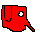
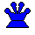

# Chess 2: The long-awaited sequel to chess
\
\
After having a brief discussion with the devloper of Chess 1 (Gary Chess, a man who we all know and love), I have been told unfortunate news:\
There will be no sequel.\
\
However, I remained determined. Chess needs a sequel, and I will make one, whether Gary Chess likes it or not.\
\
I now present: Chess 2!
## Bug fixes: 
Fixed bug where pawns will suddenly become another piece when they reach the end of the board.\
Fixed 'Castling' bug where the king can teleport behind a rook.\
Fixed strange obscure bug wherein a pawn could capture another pawn next to it "in passing" if it moved two squares the previous move.\
Removed the h5 square.\

## New features:
- Replaced white and black teams with the Red Republic and Blue Empire.
- Starting player is randomized.
- The Blue Empire has two Queens (diversity win!)
- The Red Republic overthrew their monarchy and replaced it with a President and Finance Minister
- Shop in the middle of the board (marked with yellow tiles) where you can buy various upgrades (see below)
- The shops have various items to buy. These items are either upgrades (benefit the piece that buys them) or actions (have an immediate effect). Their descriptions can be found in the shop. Pieces can use their move to give all of their upgrades to adjacent allied pieces.
- Rework of most pieces (also see below)
- Added an underworld where pieces go when they die. There is a shop in the underworld where they can revive themselves. Otherwise, the underworld functions like a normal board.
- Added an economy system:
    - Each player can see their finances during their turn on the left of the screen.
    - Players have an amount of money in their bank, a tax rate, and their populace's favorability to the war (popular opinion).
    - Money can be spent in the shops.
    - Players can force their taxes to increase on their turn instead of making a move, but that will lower popular opinion.
    - Players gain money each turn based on their tax rate times their popular opinion. Less popular opinion means more tax evasion.
    - Players can go into debt, and when that happens, they will start to rapidly lose popular opinion.
    - If the Red Republic has less than 25% popular opinion, their people immediately vote to withdraw from the war and blue will win.
    - If the Blue Empire has 0% popular opinion and is in debt, they will withdraw due to a peasant revolt and red will win.

## New pieces:
### The Elephant
\
The Elephant works just like the Horse from Chess 1, but can capture pieces adjacent to it as well.
### The Archer
\
The Archer cannot move, but it can shoot pieces 3 tiles away from it (taxicab distance). Shot pieces will die.
### The Wizard and the Pope
 \
The bishops from Chess 1 are gone as religious tensions increase. Now they are replaced with the Pope and the Wizard!\
The Pope can move like the queen from Chess 1.\
The Wizard moves just like the bishop from Chess 1, but can travel in and out of the underworld. When it dies, it does not go into the underworld.
### The President
\
The President is the leader of the Red Republic. It moves like the King from Chess 1, and when it dies, a pawn will be elected as the new President.\
Warning: The people are not happy about the president dying.
### The Finance Minister
\
The Finance Minister cannot move, but can be used to increase taxes without angering the people. It even has the chance of increasing popular opinion!
### The Queens
\
Despite looking similar to the queens from Chess 1, the Queens in Chess 2 cannot move. If they die, the Blue Empire loses.
